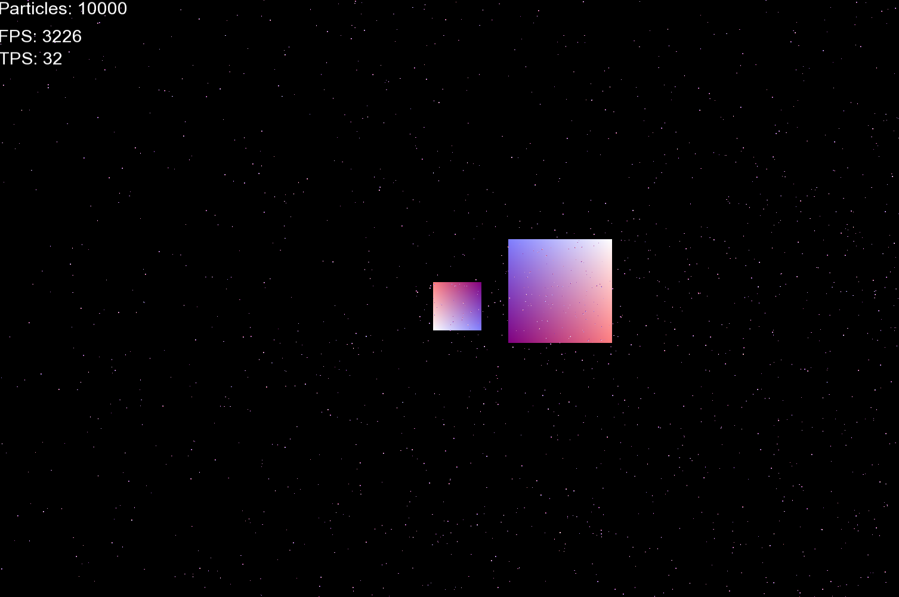
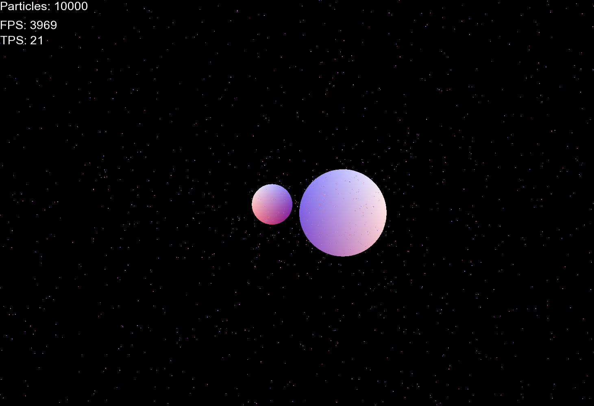

# Gravity Sim
A C++ particle gravity simulator

Using SFML for graphics, Newtonian gravity calculations, Velocity-Verlet Integration for smoother movement and the Barnes-Hut Algorithm to speed up particle calculations
https://arborjs.org/docs/barnes-hut

# Development 

This was a short passion project done in a few weeks when I had free time, it was inspired by timelapses of stars orbiting black holes.

## Next steps
* Create settings menu so user can change program settings without recompile

## Retrospective

### Everything's been done before 
optimization is very difficult for this problem, especially when I want it to be physically accurate, 
The basic algorithm is O(N^2) and with the hope of this project having 1,000,000 particles that simply won't do.  

I was going to develop my own algorithm that broke the world up into a grid that got smaller and only did the computation on a small number of particles and for large distances where gravity's effects were negligible would simply compute from the center of mass and position...
and then as I was looking at an article for 'Hierarchical Grids collision detection' I stumbled upon the exact thing I was doing: the Barnes-Hut Algorithm, yet again I'm beaten to the punch by some computer scientist in the 80s. But what can you do?

After changing my implementation slightly to align with the Barnes-Hut Algorithm my speed did significantly increase with large particle arrays.

### why reading documentation is important
For performance the program uses batch rendering, creating an array of quads (triangle) to render all the particles at once. This worked great for squares, but  I wanted to switch to circles instead since I think they look better for this application.  

Here we see the humble square and like every humble square there is always a circle just waiting to be set free.  

In previous projects I've used GLSL to have ultimate control over the graphics processing of my application. I've made fragment shaders but never a vertex shader. 

How hard could it be right?

This process was probably the most annoying and tedious of the entire project. All this could have been solved reading the documentation but it seemed easier to try and wing it. As a novice in graphics programming I should have known better but that's part of the fun. My issue was trying to properly pass data between the vertex and fragment shader and understanding how SFML sends data to the shader, I was under the impression that it wasn't using the built in functions and instead I could make my own variables and set the layout so it would be populated, this unfortunately wasn't the case. This was simply solved by reading one of the first lines in the documentation under vertex shader the answers to all my problems: https://www.sfml-dev.org/tutorials/3.0/graphics/shader/

But in the end it was all worth it. Look at that smooth circle. It was totally worth it.

